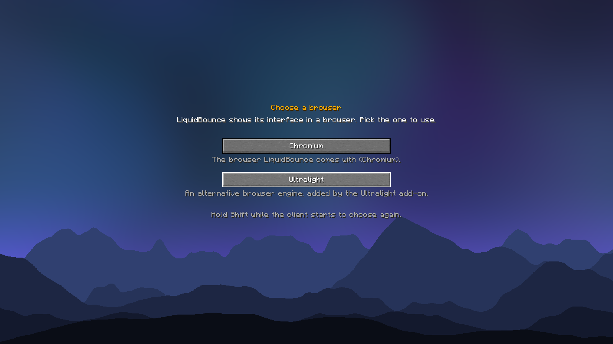
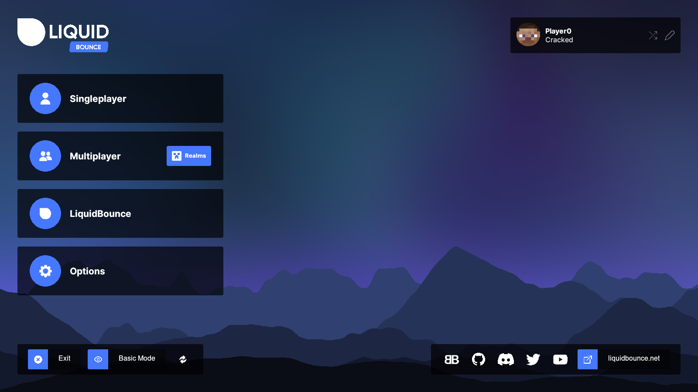

# LiquidBounce Ultralight

A [LiquidBounce](https://github.com/CCBlueX/LiquidBounce) add-on that lets the client show its menus with
[Ultralight](https://ultralig.ht) instead of the built-in Chromium. It is only an alternative: LiquidBounce does not
run better or faster with it.

With the add-on installed, LiquidBounce asks which browser to use the next time it starts. The choice is remembered;
hold Shift while the client starts to choose again. `LB_BROWSER_BACKEND=ultralight` picks it without asking.

| Choosing | Ultralight |
|---|---|
|  |  |

Ultralight 2.0 renders on the GPU through the game's own renderer, on OpenGL and Vulkan, and draws paths and text
with Photon. It runs on Linux and Windows x64 and on Apple Silicon. Its SDK is downloaded from Ultralight on the first
start. The bindings are [Ultralight Java Reborn](https://github.com/CCBlueX/ultralight-java-reborn).

## Building

```
./gradlew build
```

`./gradlew runClientGameTest` starts the client with the add-on, picks Ultralight on the selection screen and takes
the screenshots above.

## License

The add-on is licensed under the GPL 3.0 or later, see [LICENSE](LICENSE). It bundles
[7-Zip-JBinding](https://sevenzipjbind.sourceforge.net) (LGPL 2.1 with the unRAR restriction) to unpack the SDK.
Ultralight itself, including the shaders the add-on draws with, is © Ultralight, Inc. and used under its license.
